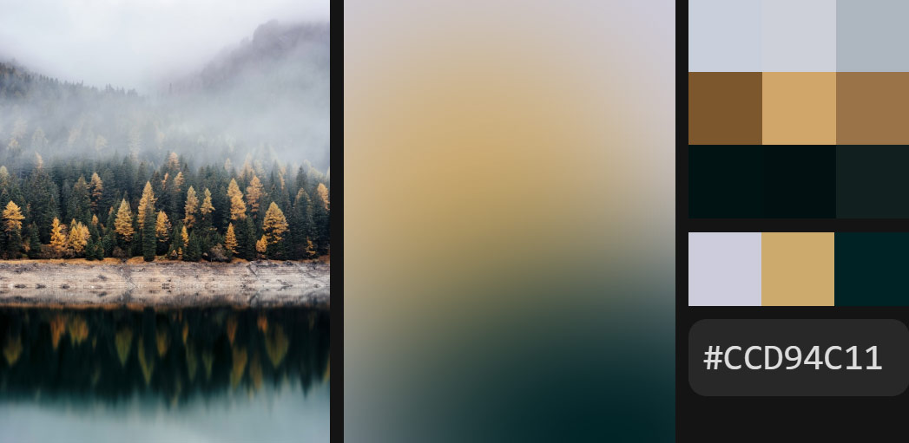

# LQIP in pure CSS

Demonstrating the LQIP CSS implementation as described in [this story](https://medium.com/@frzi/lqip-css-73dc6dda2529) by packing (and unpacking) 3 colors into a single RGBA value.

Story on [Medium](https://medium.com) and [DEV](https://dev.to).